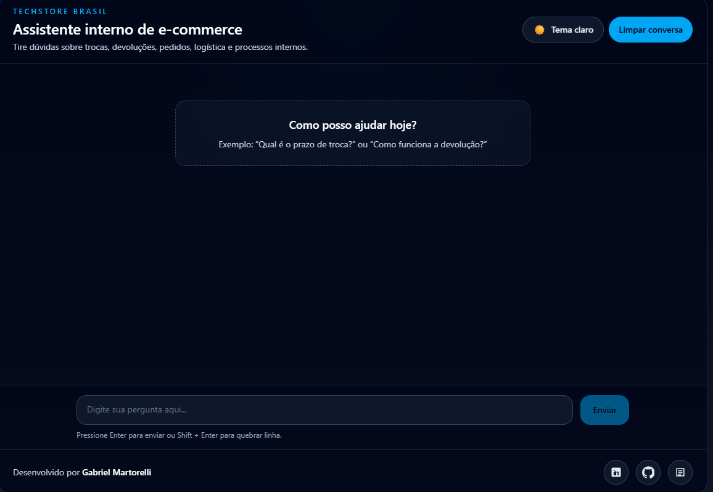
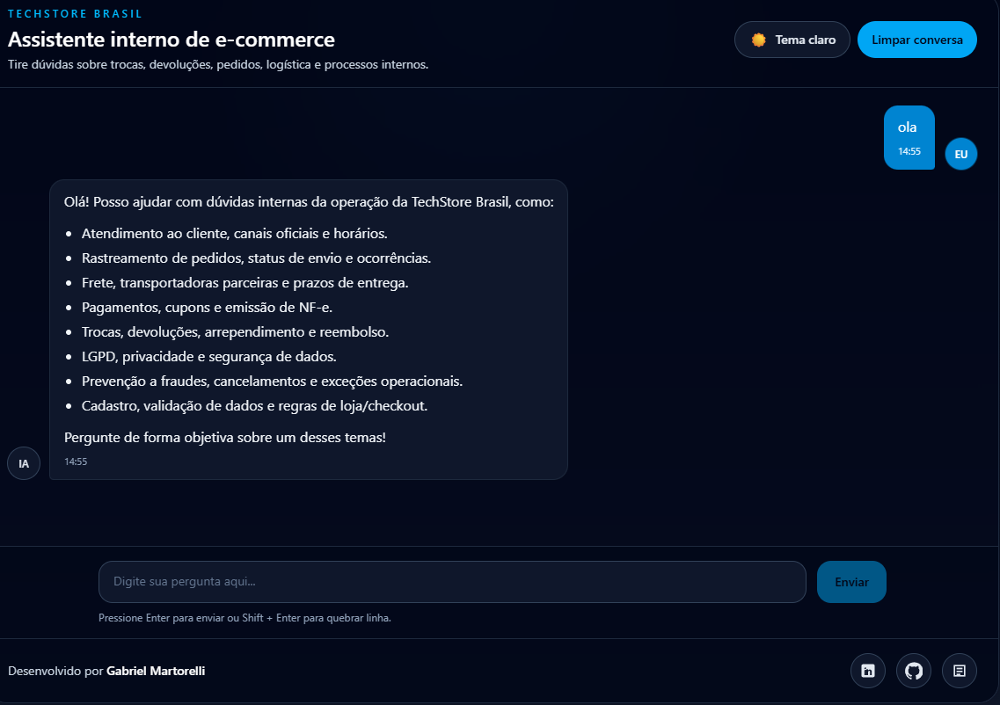
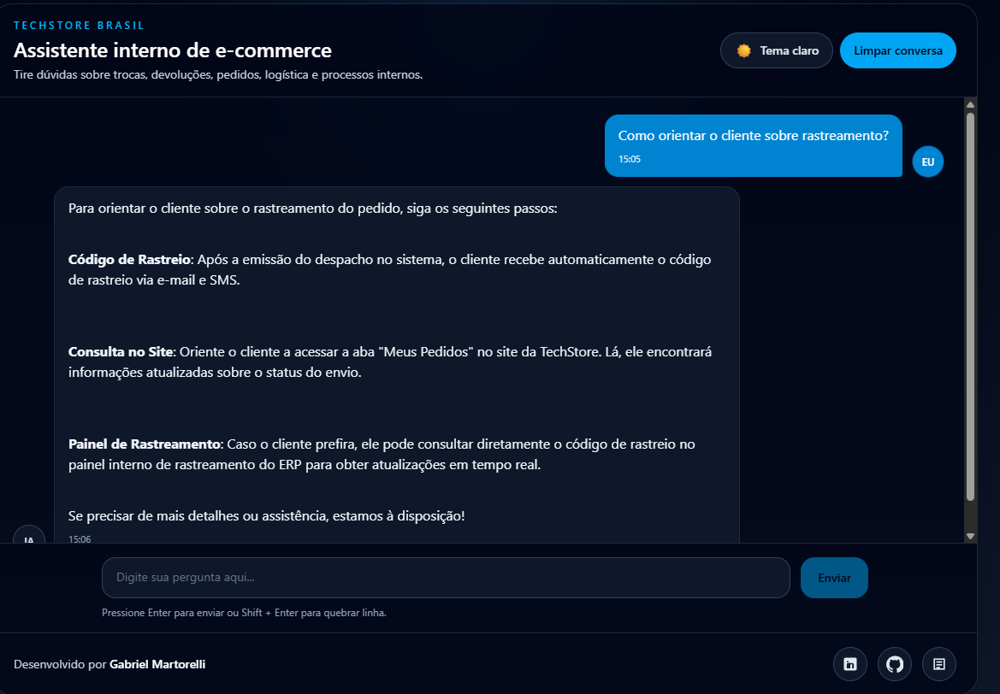
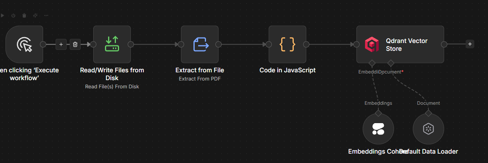
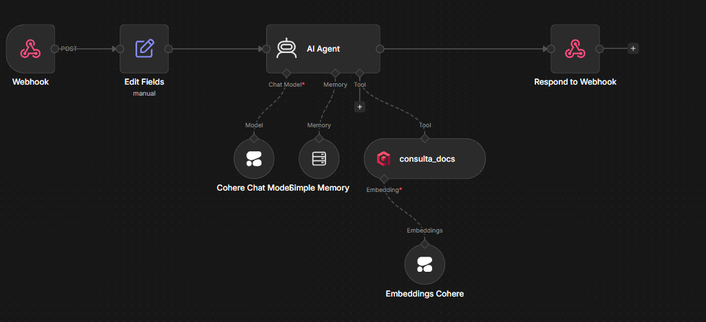

# Alura E-commerce Agent

Agente de IA corporativo para colaboradores de um e-commerce, desenvolvido para o Challenge Alura Agentes.

O projeto foi construído para responder dúvidas operacionais com base em documentos internos da empresa, utilizando arquitetura RAG (Retrieval-Augmented Generation), ingestão de PDFs, banco vetorial e orquestração com workflows de IA.

## Visão geral

Este projeto implementa um agente conversacional interno para uma operação de e-commerce.

A proposta é permitir que colaboradores consultem, em linguagem natural, processos e procedimentos internos relacionados a atendimento, logística, pagamentos, trocas, devoluções, antifraude, LGPD, cadastro e regras operacionais da loja.

A solução utiliza documentos internos em PDF como base de conhecimento, processa esses arquivos em um fluxo de ingestão, gera embeddings, armazena os vetores no Qdrant e utiliza recuperação semântica para responder perguntas com maior precisão.

## Objetivo do projeto

O objetivo deste projeto é disponibilizar um agente inteligente capaz de:

- Ler e processar documentos internos.
- Indexar conteúdo em uma base vetorial.
- Receber perguntas em linguagem natural.
- Recuperar trechos relevantes da base de conhecimento.
- Gerar respostas contextualizadas para colaboradores do e-commerce.

## Arquitetura da solução

A arquitetura foi dividida em camadas para facilitar manutenção, evolução e deploy:

### Frontend

- React + Vite
- Interface de chat simples e objetiva para interação com o agente

### Backend

- ASP.NET Core Web API
- Responsável por receber mensagens do frontend, validar a requisição, manter o ponto central de integração e encaminhar a conversa para o n8n

### Orquestração de IA

- n8n
- Responsável pelos workflows de ingestão dos documentos e pelo fluxo de chat RAG

### Modelo e embeddings

- Cohere
- Utilizado para geração de embeddings e para o modelo de linguagem da conversa

### Banco vetorial

- Qdrant
- Responsável por armazenar os embeddings e realizar a busca semântica dos documentos

### Infraestrutura

- Oracle Cloud Infrastructure (OCI)
- VM Ubuntu
- Docker Compose
- Nginx como reverse proxy
- SSL/HTTPS para os subdomínios públicos

## Fluxo da aplicação

### Ingestão da base de conhecimento

1. Os documentos PDF são adicionados à pasta de ingestão.
2. O workflow do n8n lê os arquivos.
3. O conteúdo é extraído e tratado.
4. O texto é dividido em chunks.
5. Os embeddings são gerados com Cohere.
6. Os vetores são armazenados no Qdrant.

### Conversação RAG

1. O usuário envia uma pergunta pelo frontend.
2. O frontend chama a API ASP.NET Core.
3. A API envia a requisição ao webhook do n8n.
4. O workflow de chat consulta o Qdrant.
5. Os trechos mais relevantes são recuperados.
6. O agente gera uma resposta com base no contexto encontrado.
7. A resposta retorna para a API e depois para o frontend.

## Tecnologias e ferramentas utilizadas

### Frontend

- React
- Vite
- TypeScript
- CSS

### Backend

- C#
- .NET / ASP.NET Core Web API

### IA e automação

- n8n
- Cohere
- RAG (Retrieval-Augmented Generation)

### Dados

- Qdrant

### Infraestrutura e deploy

- Docker
- Docker Compose
- Nginx
- Oracle Cloud Infrastructure (OCI)
- Ubuntu Linux

### Organização e versionamento

- Git
- GitHub

## Estrutura do projeto

```text
.
├── backend/
│   ├── AluraEcommerceAgent/
│   │   ├── AluraEcommerceAgent.Api/
│   │   ├── AluraEcommerceAgent.Application/
│   │   ├── AluraEcommerceAgent.Domain/
│   │   └── AluraEcommerceAgent.Infrastructure/
├── frontend/
        └── src/
├── docs/
│   └── pdfs/
├── infra/
│   ├── nginx/
│   └── scripts/
├── n8n-workflows/
├── docker-compose.yml
└── README.md
```

## Organização do backend

O backend foi estruturado com separação por projetos para seguir princípios de organização, manutenção e evolução:

- `AluraEcommerceAgent.Api`: camada de apresentação e entrada HTTP
- `AluraEcommerceAgent.Application`: casos de uso, DTOs, validações e contratos da aplicação
- `AluraEcommerceAgent.Domain`: regras centrais e abstrações de domínio
- `AluraEcommerceAgent.Infrastructure`: serviços externos, options, integrações e injeção de dependência

Essa separação foi pensada para manter o projeto mais aderente a SOLID, DDD e boas práticas de arquitetura em .NET.

## Workflows n8n

Os workflows do projeto ficam na pasta `n8n-workflows/`.

Exemplos de workflows utilizados:

- `01-kb-pdf-ingestion-and-indexing.json`
- `02-kb-rag-chat-webhook.json`

Esses workflows representam, respectivamente:

- o pipeline de ingestão da base de conhecimento;
- o fluxo de chat com recuperação semântica e geração de resposta.

## Infraestrutura de deploy

O projeto foi pensado para rodar em uma única VM Ubuntu na OCI, com os serviços orquestrados por Docker Compose.

### Serviços na VM

- Frontend React
- Backend ASP.NET Core Web API
- n8n
- Qdrant

### Regras de exposição pública

- Apenas as portas 80 e 443 ficam abertas publicamente.
- O Nginx é o reverse proxy principal da VM.
- Cada serviço público utiliza subdomínio próprio.
- O Qdrant não é exposto publicamente.
- O frontend não chama o n8n diretamente em produção.
- O backend é o ponto central de comunicação entre frontend e n8n.

## Subdomínios do projeto

Exemplo de organização de subdomínios:

- `https://colab.martodev.online` → frontend
- `https://api-colab.martodev.online` → backend
- `https://robo.martodev.online` → n8n

## Como executar o projeto localmente

### Pré-requisitos

- Node.js
- .NET SDK
- Docker
- Docker Compose
- Conta na Cohere
- Ambiente n8n disponível
- Instância do Qdrant

### 1. Clonar o repositório

```bash
git clone <URL_DO_REPOSITORIO>
cd alura-ecommerce-agent
```

### 2. Configurar o frontend

Instale as dependências:

```bash
cd frontend
npm install
```

Ajuste os arquivos de ambiente conforme o seu cenário local.

### 3. Configurar o backend

Volte para a raiz e execute o backend:

```bash
cd backend/AluraEcommerceAgent
dotnet restore
dotnet build
```

### 4. Subir serviços auxiliares

Na raiz do projeto:

```bash
docker compose up -d
```

### 5. Executar o frontend

```bash
cd frontend
npm run dev
```

### 6. Executar a API

```bash
cd backend/AluraEcommerceAgent/AluraEcommerceAgent.Api
dotnet run
```

## Como funciona a ingestão dos documentos

O pipeline de ingestão faz o seguinte:

- leitura dos PDFs;
- extração do texto;
- limpeza e normalização do conteúdo;
- divisão em chunks;
- enriquecimento com metadados;
- geração de embeddings;
- inserção dos vetores no Qdrant.

Esse fluxo permite que o agente consulte trechos relevantes da base de conhecimento durante a conversa.

## Fonte de informação utilizada

A base de conhecimento do projeto foi construída a partir de documentos internos em PDF relacionados a:

- atendimento ao cliente;
- envios e logística;
- reembolso e devoluções;
- termos operacionais;
- privacidade e LGPD.

## Exemplos de perguntas que o agente consegue responder

- Quais são os canais oficiais de atendimento ao cliente?
- Como funciona o prazo de devolução por arrependimento?
- Em quanto tempo o reembolso deve ser processado?
- O cliente tem direito a troca por tamanho ou cor?
- Como o colaborador deve orientar o rastreamento do pedido?
- Quais dados pessoais podem ser compartilhados segundo a política interna?
- Como funciona a regra de frete grátis?
- O que fazer em caso de suspeita de fraude em um pedido?

## Exemplos de respostas do agente

### Exemplo 1

**Pergunta:** Como funciona a devolução por arrependimento?

**Resposta esperada do agente:**  
A devolução por arrependimento na TechStore Brasil segue as regras abaixo:

- Prazo: Solicitações devem ser enviadas em até 7 dias corridos após o recebimento do produto.
- Condições: O produto deve ser devolvido na embalagem original e sem marcas de uso.
- Reembolso: Se as condições forem atendidas, o estorno é integral e processado após validação da solicitação e perícia do produto.

### Exemplo 2

**Pergunta:** Quais são os canais oficiais de atendimento?

**Resposta esperada do agente:**  
Os canais oficiais de atendimento da TechStore Brasil são:

- Chat do site
- WhatsApp: (11) 4000-0000
- E-mail: atendimento@techstorebrasil.com.br

A equipe de suporte está disponível de segunda a sábado, das 9h às 20h.

### Exemplo 3

**Pergunta:** Como orientar o cliente sobre rastreamento?

**Resposta esperada do agente:**  
Para orientar o cliente sobre o rastreamento do pedido, siga estas etapas:

- Código de Rastreio: Após a emissão do despacho no sistema, o cliente recebe automaticamente o código de rastreio via e-mail e SMS.

- Consulta no Site: Oriente o cliente a acessar a aba "Meus Pedidos" no site da TechStore. Lá, ele encontrará informações atualizadas sobre o status do envio.

- Painel de Rastreamento: Se necessário, o cliente pode consultar diretamente o código de rastreio no painel interno de rastreamento do ERP para obter atualizações em tempo real.

## Agente inteligente funcional

O projeto entrega um agente funcional baseado em documentos internos, com:

- processamento da base documental;
- indexação vetorial;
- recuperação semântica;
- geração de respostas contextualizadas.

O agente foi projetado para responder perguntas com base no conteúdo da documentação e reduzir dependência de consulta manual por parte dos colaboradores.

## Evidência do deploy na OCI

Este projeto foi planejado para deploy em Oracle Cloud Infrastructure (OCI), utilizando uma VM Ubuntu como ambiente principal.

### Evidências a incluir neste repositório

- Link público da aplicação em funcionamento
- Captura de tela da aplicação em produção
- Captura de tela ou evidência do ambiente publicado na OCI

### Links públicos

- Frontend: `https://colab.martodev.online`
- API: `https://api-colab.martodev.online`

## Capturas de tela

### Tela inicial do agente



### Saudação inicial do agente



### Resposta operacional sobre rastreamento



### Workflow de ingestão documental no n8n



### Workflow de chat RAG no n8n



## Entregáveis do Challenge Alura Agentes

Este repositório busca atender aos seguintes entregáveis do desafio:

- Repositório público no GitHub com código-fonte do projeto
- Histórico de commits refletindo a evolução do desenvolvimento
- Estrutura organizada e fácil de compreender
- README com descrição geral, arquitetura, tecnologias, instruções de execução e exemplos
- Agente inteligente funcional baseado em documentos
- Código para leitura e processamento da base documental
- Evidência de deploy na OCI

## Melhorias futuras

- Upload de documentos via interface administrativa
- Histórico persistente de conversas
- Painel de monitoramento operacional
- Reprocessamento automático da base de conhecimento
- Observabilidade e métricas
- Autenticação e controle de acesso para ambiente corporativo

## Observações finais

Este projeto foi desenvolvido como solução para o Challenge Alura Agentes, com foco em arquitetura organizada, uso de IA aplicada ao contexto corporativo e deploy em nuvem utilizando OCI.
